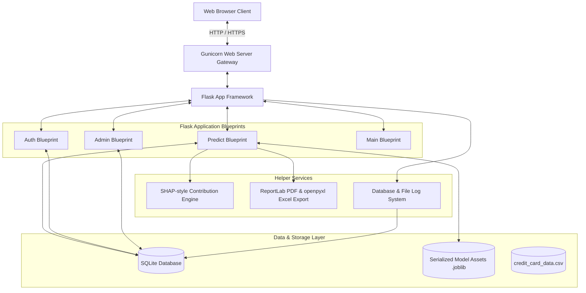
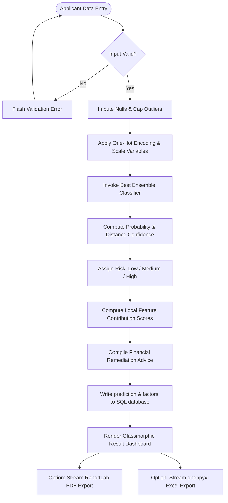
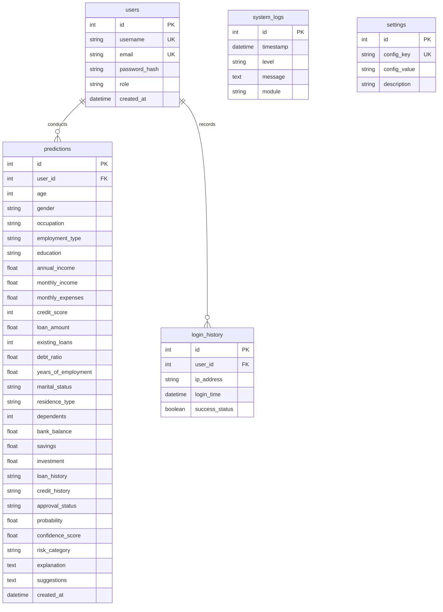
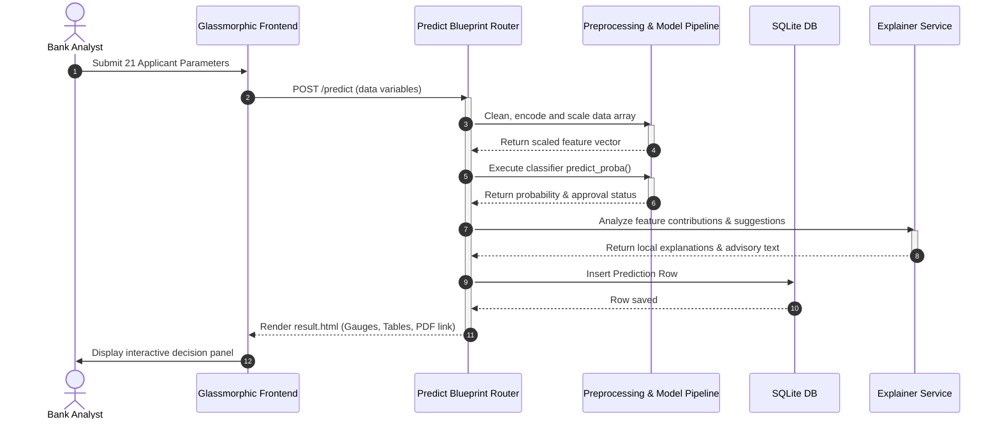
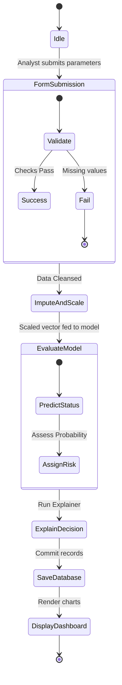
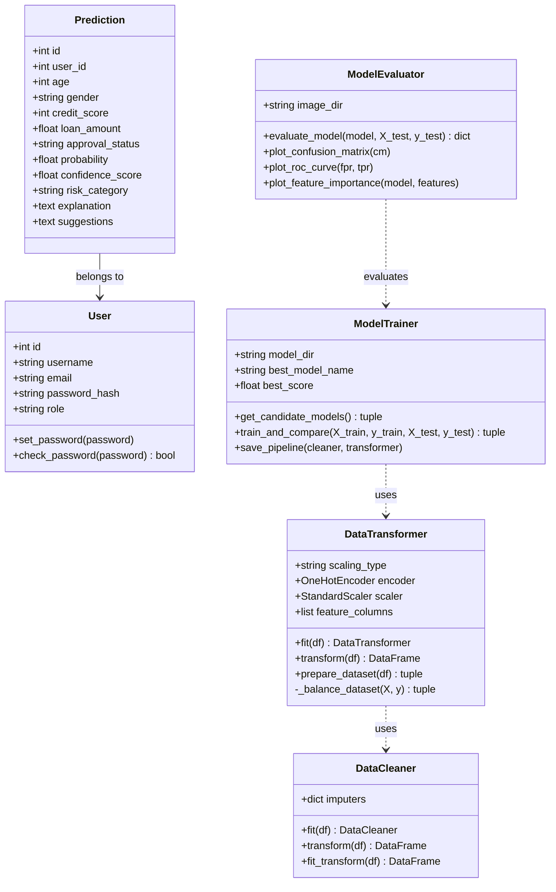
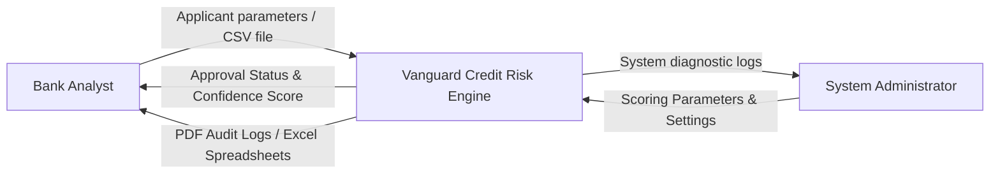
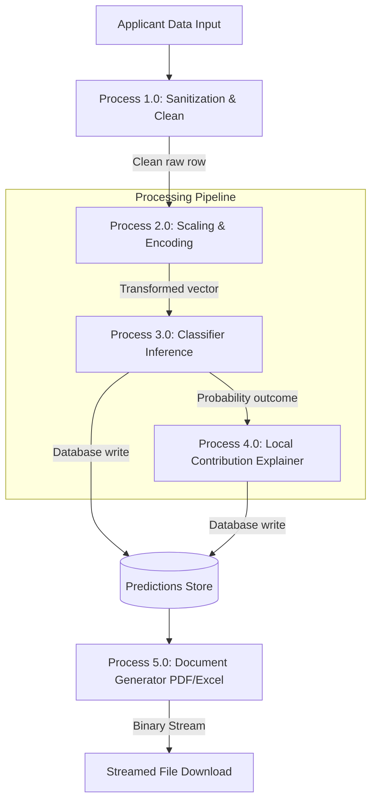

# Vanguard System Documentation & Engineering Manual

This manual provides a detailed technical report, design diagrams, architectural outlines, operation guidelines, and interview FAQs for the Vanguard Credit Card Approval Prediction System.

---

## 1. System Engineering Diagrams

The following Mermaid diagrams model the logical architectures, data flows, and structures governing the application.

### A. Core Architecture Diagram


---

### B. Logical Application Flowchart


---

### C. Entity-Relationship (ER) Diagram


---

### D. Use Case Diagram
```mermaid
left-to-right direction
actor Analyst
actor Administrator

rectangle VanguardSystem {
    usecase "Login & Authenticate" as UC1
    usecase "Input Single Applicant" as UC2
    usecase "Bulk Upload CSV Batch" as UC3
    usecase "Download PDF Audit Report" as UC4
    usecase "Download Excel Ledger" as UC5
    usecase "Edit Credit Scoring Thresholds" as UC6
    usecase "View System Log Stream" as UC7
    usecase "View User Accounts" as UC8
}

Analyst --> UC1
Analyst --> UC2
Analyst --> UC3
Analyst --> UC4
Analyst --> UC5

Administrator --> UC1
Administrator --> UC6
Administrator --> UC7
Administrator --> UC8
```

---

### E. Execution Sequence Diagram


---

### F. Application Activity Diagram


---

### G. System Class Diagram


---

### H. Data Flow Diagram Level 0 (Context)


---

### I. Data Flow Diagram Level 1 (Process Breakdown)


---

## 2. Comprehensive Developer Manual

### A. Introduction & System Goal
The Vanguard system delivers high-accuracy credit underwriting by comparing multiple classification models on boot. A local contribution explainer breaks down predictions for transparency.

### B. Machine Learning Preprocessing Details
1. **Deduplication:** Dropped matching applicant rows.
2. **Imputation:** Median values resolve numerical blanks; mode values address categorical fields.
3. **Outlier Mitigation:** Capping extreme values at the 1.5x IQR boundary prevents model skewing.
4. **Encoding:** Standard label lists translate basic values, while One-Hot encoders process complex fields.
5. **Standardization:** Columns undergo zero-mean standard scaling.

### C. Model Training & Comparison Results
The pipeline trains 9 standard classification frameworks:
1. Logistic Regression (tuning regularization $C$)
2. Decision Tree Classifier (tuning tree depth)
3. Random Forest (tuning estimator counts)
4. Gradient Boosting Classifier (tuning learning rate)
5. AdaBoost Classifier (tuning estimator metrics)
6. Extra Trees Classifier (tuning tree counts)
7. XGBoost Classifier (tuned via gradient boosting parameters)
8. LightGBM Classifier (tuned via tree leaves)
9. CatBoost Classifier (tuned via boosting parameters)

The model achieving the highest validation set ROC AUC is saved automatically using Joblib.

---

## 3. End-User Manual

### System Access
1. Visit `http://localhost:5000/`.
2. Login with credentials.
3. Use the sidebar to navigate the app's features.

---

## 4. Interview Preparation Q&A

### Q1: Why use dynamic model comparisons over a static model?
**Answer:** Ensemble pipelines account for changes in data distributions. By comparing multiple algorithms on boot, the system automatically selects the best classifier for current data profiles.

### Q2: How does the local feature contributor work?
**Answer:** It compares individual input data against population averages in standard deviation units, multiplying these deviations by model feature importances to identify which factors heavily influenced the decision.
